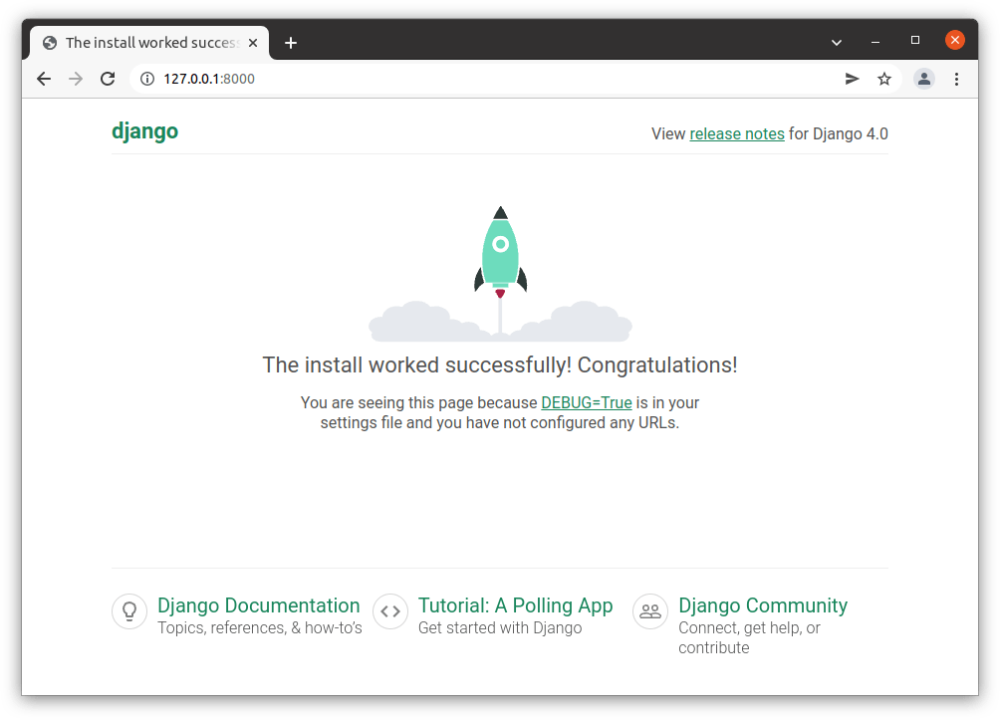

<h1>Olá Django!</h1>
<h2>Criando um Ambiente Virtual e Instalando o Django</h2>

<h3>No diretório que você vai criar o projeto e com o Python instalado na máquina, você vai criar um ambiente virtual</h3>

<h3>Criando a pasta do projeto na pasta Django</h3>
<pre>C:\Documentos\Django\> mkdir ola_django</pre>

<h3>Criando o ambiente virtual</h3>
<pre>C:\Documentos\Django\ola_django> python -m venv venv</pre>

<h3>Iniciando o ambiente Virtual para instalar o Django</h3>
<pre>C:\Documentos\Django\ola_django> .\venv\Scripts\activate</pre>

Se houve erro ao executar o script, temos uma solução <a href="#erro">mais abaixo</a>!

<h3>Desligando o Venv</h3>
<pre>(venv) PS C:\Documentos\Django\ola_django> deactivate</pre>

<h3>Instalando o Django</h3>
<pre>(venv) PS C:\Documentos\Django\ola_django> pip install django</pre>

<h3>Começando o projeto na pasta "ola_django"</h3>
<pre>(venv) PS C:\Documentos\Django\ola_django> django-admin.exe startproject project .</pre>

Isso criará uma estrutura de pastas como esta:

<pre>
📁ola_django/
 └📄manage.py
 └📁project
   └📄__init__.py
   └📄asgi.py
   └📄settings.py
   └📄urls.py
   └📄wsgi.py
</pre>

<h3>Verificando se o Django já está Online</h3>
<pre>(venv) PS C:\Documentos\Django\ola_django> python manage.py runserver</pre>

Output:

<pre>Starting development server at http://127.0.0.1:8000/
Quit the server with CTRL-BREAK.</pre>

Acessando: http://127.0.0.1:8000/

Para desligar o servidor, basta apertar <code>CTRL + C</code>.

<!-- Trantado Erro -->
<h2 id="erro">Possível Erro</h2>

No meu caso:

<pre>C:\Documentos\Django\ola_django> .\venv\Scripts\activate
O arquivo C:\Users\erick\Documentos\Django\ola_django\venv\Scripts\Activate.ps1 não pode ser carregado porque a execução de scripts foi desabilitada neste sistema. Para obter mais informações, consulte about_Execution_Policies em https://go.microsoft.com/fwlink/?LinkID=135170.</pre>

Esse erro acontece porque o Windows tem uma política de segurança que impede a execução de scripts do PowerShell por padrão. Para resolver isso, você precisa alterar a política de execução. Solução:

<h3>1. Abra o PowerShell como administrador</h3>

Pressione <code>Win + S</code>, digite PowerShell, clique com o botão direito em Windows PowerShell e selecione Executar como Administrador.

<h3>2. Verifique a política de execução atual</h3>

Execute o seguinte comando no PowerShell:

<pre>Get-ExecutionPolicy</pre>

Se o resultado for <code>Restricted</code>, significa que os scripts estão bloqueados.

<h3>3. Permitir a execução de scripts</h3>

Para permitir a execução de scripts na sua máquina, rode este comando:

<pre>Set-ExecutionPolicy Unrestricted -Scope CurrentUser</pre>

<h3>4. Ativar o ambiente virtual novamente</h3>

Agora, tente ativar o ambiente virtual no PowerShell:

<pre>.\venv\Scripts\activate</pre>

<!-- Extra -->
<h2>Extra</h2>
<h3>Bibliotecas Instaladas no seu Ambiente</h3>
<h3>Conforme visto anteriormente, usando o comando <a href="https://pt.wikipedia.org/wiki/Pip_(gerenciador_de_pacotes)">pip install</a> você instala bibliotecas no seu ambiente virtual. Mas como vemos quais nós temos instaladas no ambiente? Simples:
Listando todas as Bibliotecas Instaladas:</h3>

O comando pip freeze lista os pacotes instalados com suas versões exatas.

<pre>pip freeze</pre>

<h3>Para mandar as bibliotecas necessárias para um arquivo</h3>

Você pode mandar essa lista de bibliotecas necessárias para o projeto em um documento .txt da seguinte forma:

<pre>pip freeze > requirements.txt</pre>

<h3>Para instalar as bibliotecas necessárias</h3>

A pessoa, ou até mesmo você se receber um documento requirements.txt e precisar instalar, vai usar o seguinte comando para instalar as bibliotecas no ambiente do projeto:

<pre>pip install -r requirements.txt</pre>

<h3>Atualizando o pip</h3>

Algumas vezes a biblioteca pode dar problema, como ocorreu nesse projeto, e para resolver o problema de atualização, basta utilizar o seguinte comando para atualizar as bibliotecas:

<pre>pip install pip --upgrade</pre>
