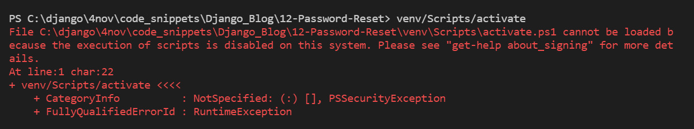

<h1>Olá Django!</h1>
<h2>Criando um Ambiente Virtual e Instalando o Django</h2>

<h3>No diretório que você vai criar o projeto e com o Python instalado na máquina, você vai criar um ambiente virtual</h3>

<h3>Criando a pasta do projeto na pasta Django</h3>
<pre>E:\Documentos\Udemy\Django\> mkdir ola_django</pre>

<h3>Criando o ambiente virtual</h3>
<pre>E:\Documentos\Udemy\Django\ola_django> python -m venv venv</pre>

<h3>Iniciando o ambiente Virtual para instalar o Django</h3>
<pre>E:\Documentos\Udemy\Django\ola_django> .\venv\Scripts\activate</pre>

Se houve erro ao executar o script, temos uma solução mais abaixo!

<h4>Desligando o Venv</h4>
<pre>(venv) PS E:\Documentos\Udemy\Django\ola_django> deactivate</pre>

<h3>Instalando o Django</h3>
<pre>(venv) PS E:\Documentos\Udemy\Django\ola_django> pip install django</pre>

<h3>Começando o projeto na pasta "ola_django"</h3>
<pre>(venv) PS E:\Documentos\Udemy\Django\ola_django> django-admin.exe startproject project .</pre>

<h3>Verificando se o Django já está Online</h3>
<pre>python manage.py runserver</pre>
<pre>http://127.0.0.1:8000/</pre>

<h3>Criando o requirements.txt</h3>
<pre>pip freeze > requirements.txt</pre>

<!-- Trantado Erro -->
<h2>Possível Erro</h2>

No meu caso:

<pre>ola_django> .\venv\Scripts\activate
O arquivo C:\Users\erick\Documentos\Django\ola_django\venv\Scripts\Activate.ps1 não pode ser carregado porque a execução de scripts foi desabilitada neste sistema. Para obter mais informações, consulte about_Execution_Policies em https://go.microsoft.com/fwlink/?LinkID=135170.</pre>

Esse erro acontece porque o Windows tem uma política de segurança que impede a execução de scripts do PowerShell por padrão. Para resolver isso, você precisa alterar a política de execução. Solução:

<h3>1. Abra o PowerShell como administrador</h3>

Pressione <code>Win + S</code>, digite PowerShell, clique com o botão direito em Windows PowerShell e selecione Executar como Administrador.

<h3>2. Verifique a política de execução atual</h3>

Execute o seguinte comando no PowerShell:

<pre>Get-ExecutionPolicy</pre>

Se o resultado for <code>Restricted</code>, significa que os scripts estão bloqueados.

<h3>3. Permitir a execução de scripts</h3>

Para permitir a execução de scripts na sua máquina, rode este comando:

<pre>Set-ExecutionPolicy Unrestricted -Scope CurrentUser</pre>

<h3>4. Ativar o ambiente virtual novamente</h3>

Agora, tente ativar o ambiente virtual no PowerShell:

<pre>.\venv\Scripts\activate</pre>

<!-- <h2>Iniciando o projeto com django-admin startproject</h2>

<h3></h3>
<pre></pre>

<h3></h3>
<pre></pre>

<h3></h3>
<pre></pre>

<h3></h3>
<pre></pre>

<h3></h3>
<pre></pre>

<h3></h3>
<pre></pre>

<h3></h3>
<pre></pre>

<h3></h3>
<pre></pre>

<h3></h3>
<pre></pre>

<h3></h3>
<pre></pre> -->
